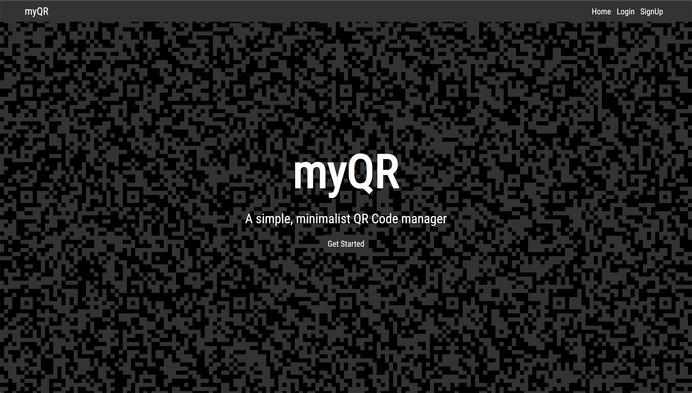
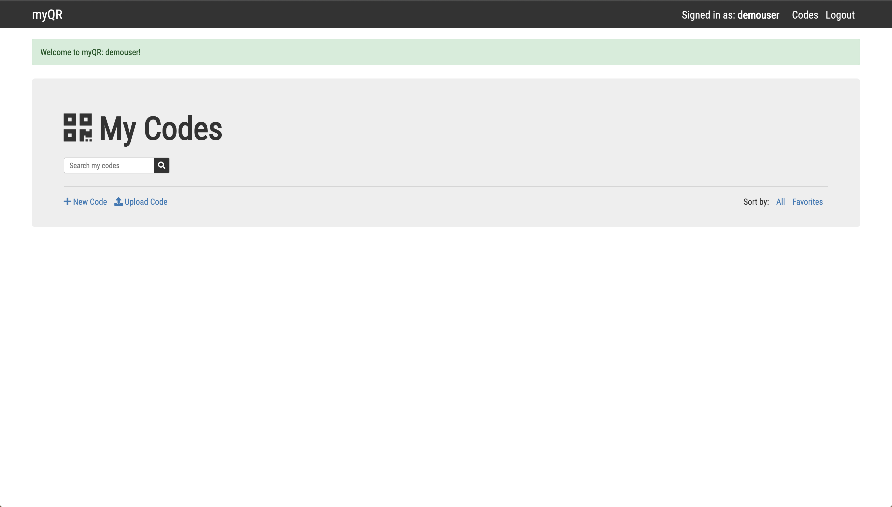
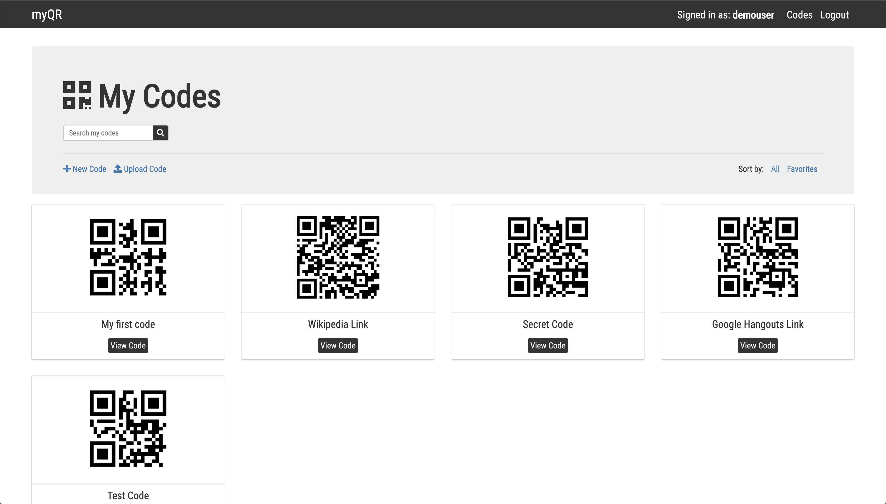
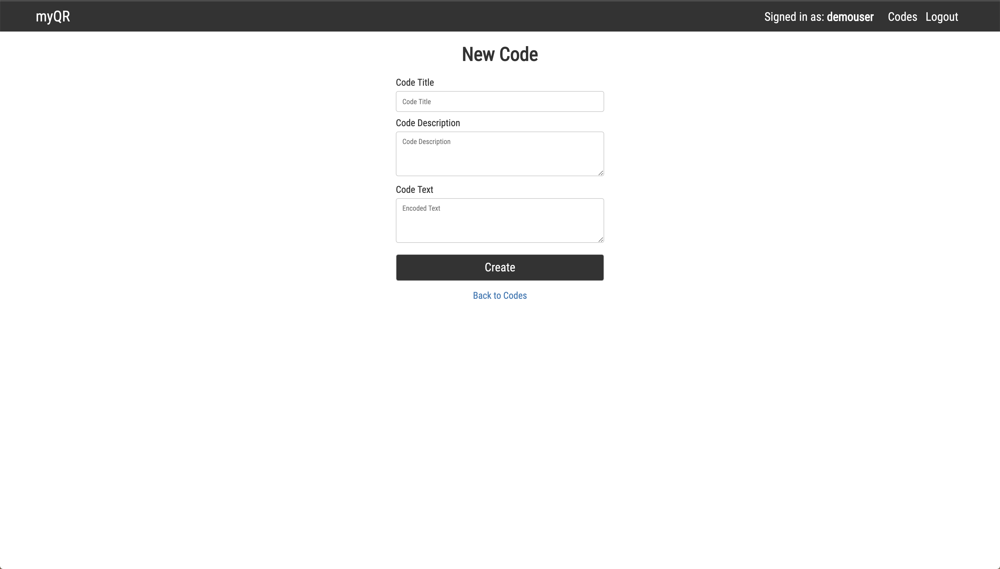
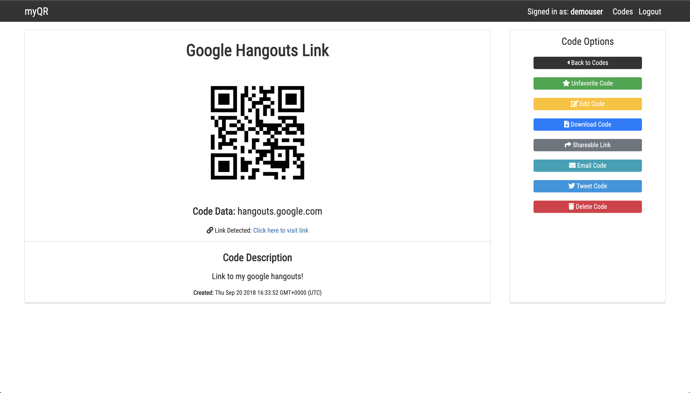
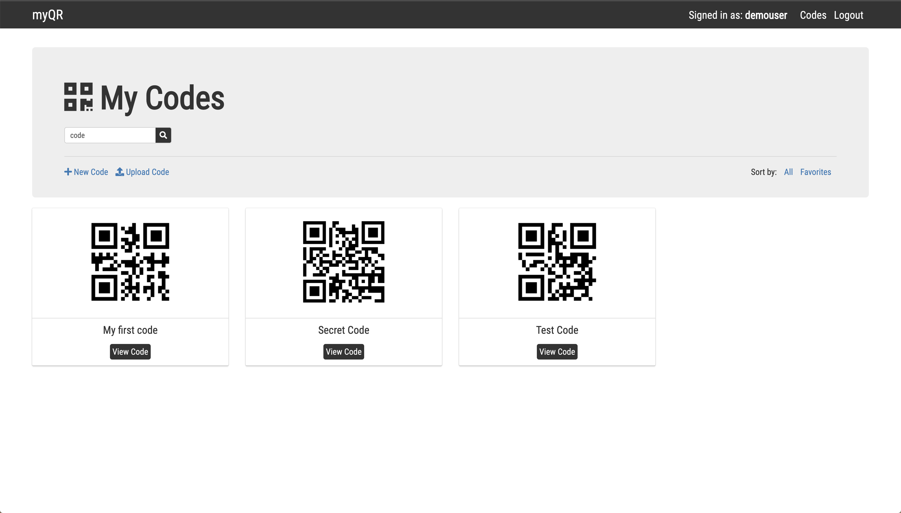
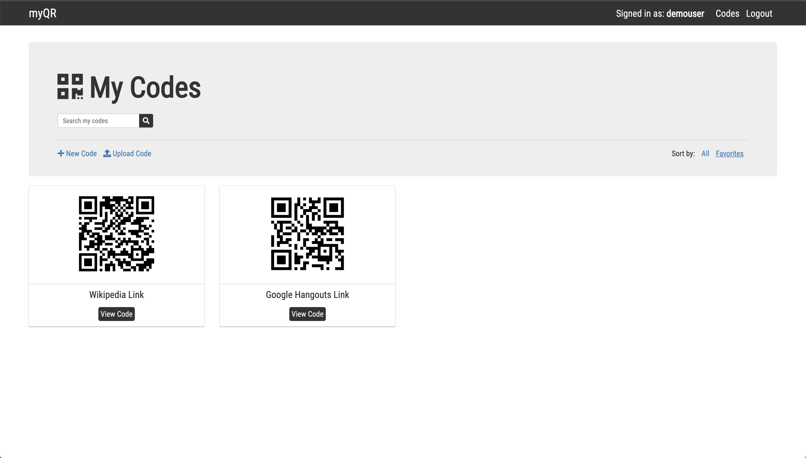

myQR 
====

A simple, minimalistic QR code manager 
--------------------------------------

### [Live Link](https://myqr.herokuapp.com/) 
--------------------------------------------

Summary
=======
myQR is a full-stack application that allows users to create, view, modify, and delete QR Codes. Users can create new QR codes with their own encoded text. Users have the ability to download and share these codes with current and non-users of the app. Users are also able to organize and search through all of their own codes. Users also have the option to upload an image of an existing QR Code (this feature currently supports small png/jpg images).

Screenshots
-----------

